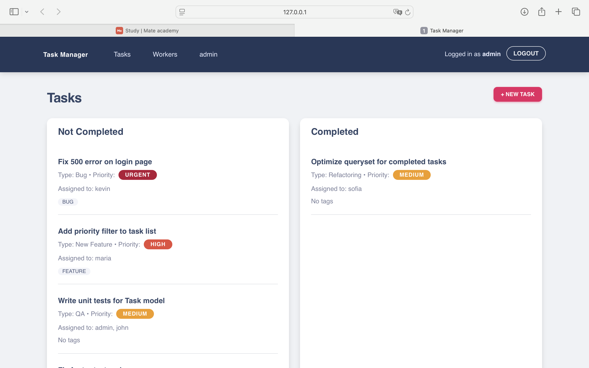
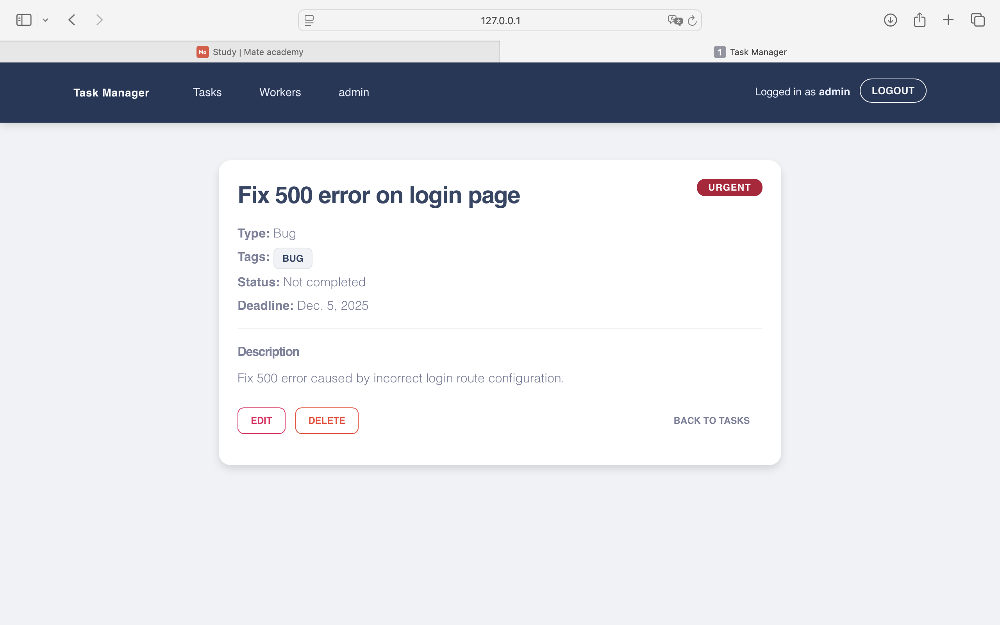
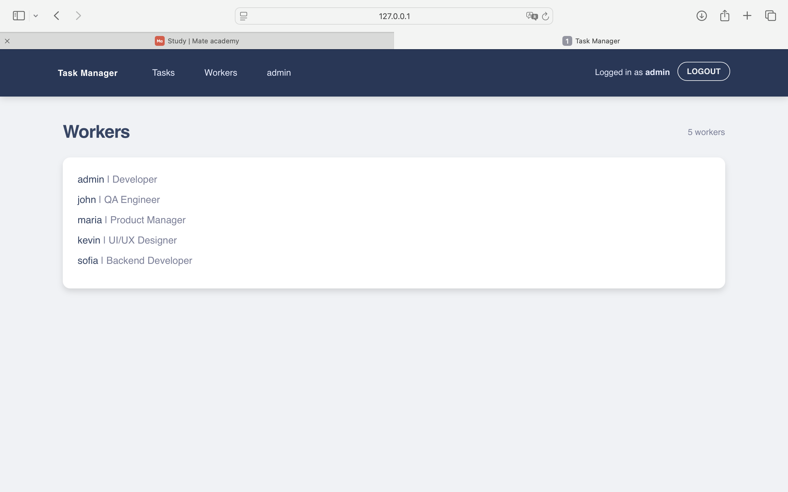
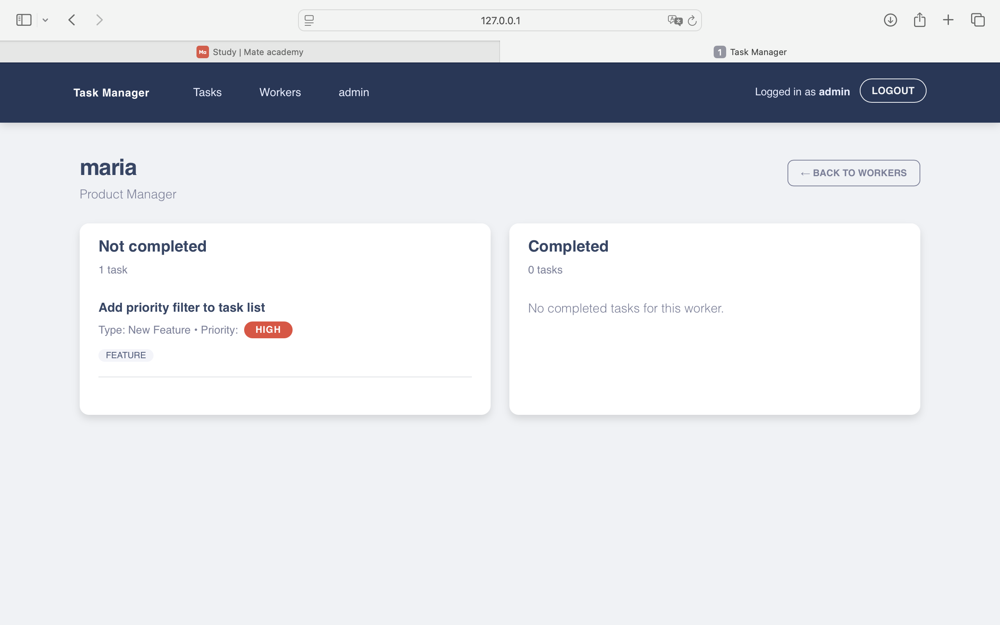

# Task Manager

Um sistema simples de gerenciamento de tarefas com autenticação, atribuição de tarefas a trabalhadores e separação entre tarefas completas e incompletas.

---

## Screenshots

### Lista de Tarefas  
*(exibe tarefas pendentes e concluídas separadamente)*  


### Detalhe da Tarefa  
*(mostra tipo, prioridade, tags e responsáveis)*  


### Lista de Workers  
*(lista todos os usuários cadastrados no sistema)*  


### Detalhe do Worker  
*(mostra as tasks atribuídas a esse worker)*  


---

## Funcionalidades

- Autenticação de usuário (login/logout)
- Página de lista de tarefas com:
  - Separação entre **tarefas completas** e **tarefas incompletas**
  - Exibição apenas das tarefas atribuídas ao usuário autenticado
- Criar, editar e deletar tarefas
- Adicionar **tags** às tarefas
- Página de **Workers**
  - Lista de todos os workers
  - Página de detalhes com tarefas completas/incompletas daquele worker
- Navegação clara entre as páginas
- Estilização utilizando **Material Kit + CSS customizado**

---

## Tecnologias utilizadas

- **Python 3.13**
- **Django 5**
- Banco de dados: **SQLite3**
- **Material Kit** como base do layout
- HTML + CSS + Bootstrap
- Django templates

---
```md
## Estrutura do projeto

project_root/
|
├── accounts/                      # App responsável por usuários (Workers)
│   ├── models.py                  # Worker customizado + Position
│   ├── views.py                   # Listagem e detalhe de workers
│   ├── urls.py                    # Rotas do app accounts
│   ├── admin.py                   # Integração do Worker com o Django Admin
│   └── migrations/                # Migrações do app accounts
|
├── tasks/                         # App principal de tarefas
│   ├── models.py                  # Task, TaskType e Tag
│   ├── views.py                   # List, Detail, Create, Update, Delete
│   ├── forms.py                   # Formulário de criação/edição de tarefas
│   ├── urls.py                    # Rotas do app tasks
│   └── migrations/                # Migrações do app tasks
|
├── templates/
│   ├── base.html                  # Template base com navbar e layout geral
│   ├── registration/              # Templates de autenticação
│   │   └── login.html
│   ├── accounts/                  # Templates de workers
│   │   ├── worker_list.html
│   │   └── worker_detail.html
│   └── tasks/                     # Templates de tarefas
│       ├── task_list.html
│       ├── task_detail.html
│       ├── task_form.html
│       └── task_confirm_delete.html
|
├── static/
│   ├── css/
│   │   └── custom.css             # Estilos personalizados
│   └── screenshoots/              # Imagens usadas no README
│       ├── task_list.png
│       ├── task_detail.png
│       ├── worker_list.png
│       └── worker_detail.png
|
├── config/                        # Configurações do Django
│   ├── settings.py
│   ├── urls.py
│   └── wsgi.py
|
├── manage.py                      # Executável principal do Django
└── requirements.txt               # Dependências do projeto
```
---

## Instalação do projeto

# 1. Clone o repositório
git clone <REPO_URL>
cd <REPO_NAME>

# 2. Crie o ambiente virtual
python3 -m venv venv

# 3. Ative o ambiente virtual
# macOS / Linux:
source venv/bin/activate
# Windows:
venv\Scripts\activate

# 4. Instale as dependências
pip install -r requirements.txt

# 5. Execute as migrações
python manage.py migrate

# 6. Crie um superusuário (opcional, mas útil para o admin)
python manage.py createsuperuser

# 7. Inicie o servidor
python manage.py runserver
